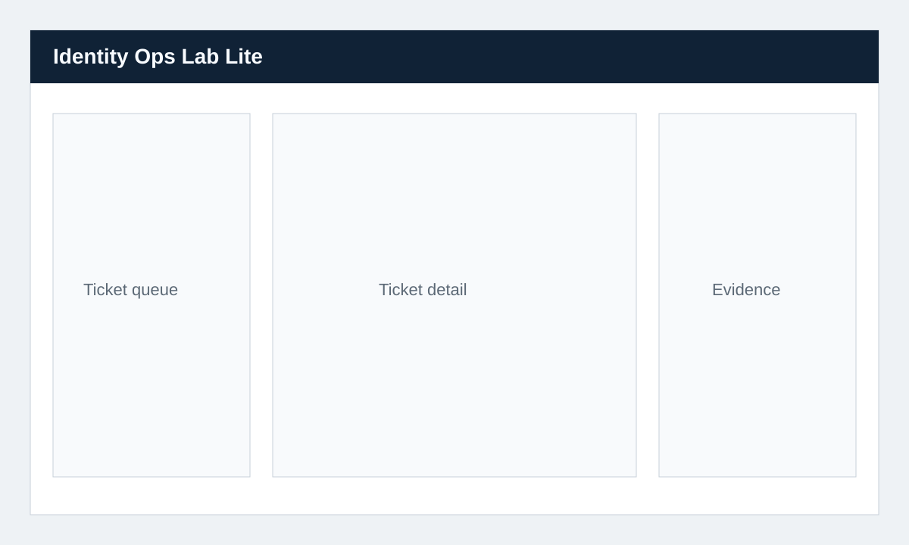

# Identity Ops Lab Lite

Identity Ops Lab Lite is a clone-and-run IAM operations simulator for practicing identity support workflows without touching a real tenant. Operators investigate realistic tickets, review sign-in evidence, ask deterministic employee personas questions, perform safe simulated admin actions, request retry verification, and close tickets only after the simulated identity state is fixed.



This is the public community/demo edition. It intentionally avoids live Entra execution, Microsoft Graph writes, scoring, premium scenario packs, hosted SaaS behavior, tenant mapping automation, Ollama/LLM persona generation, and advanced autonomous persona generation.

Lite uses deterministic scripted personas only. That keeps the lab reproducible, reviewable, public-safe, and focused on IAM operations rather than chatbot behavior.

## Why This Is Not A Ticket System

The ticket queue is only the intake surface. The lab models the IAM operation behind the ticket:

- A server-side access engine evaluates account, MFA, group, application, and managed-device state.
- Operators see IAM evidence, not hidden scenario truth.
- Remediation actions mutate simulated identity state and write audit events.
- Retry phrases trigger a fresh server-side access check.
- Ticket closure is blocked until the identity resolution gate is satisfied.

```text
Ticket symptom
  -> IAM evidence
  -> server-side access engine
  -> simulated admin action
  -> audit event
  -> retry verification
  -> close gate
```

## Quickstart With Docker

```bash
git clone https://github.com/YOUR-ORG/identity-ops-lab-lite.git
cd identity-ops-lab-lite
docker compose up --build
```

Open [http://localhost:5173](http://localhost:5173).

The API binds to `127.0.0.1:4173` through Compose. The web console binds to `127.0.0.1:5173`.

## Quickstart With Node

```bash
npm install
npm run dev
```

Open [http://localhost:5173](http://localhost:5173).

## Demo Role

You are the IAM Support Operator. The simulator gives you realistic evidence, not hidden scenario truth. Use the identity case queue, employee profile, policy evidence, authentication evidence, audit log, resolution gate, simulated admin actions, and ticket conversation to diagnose each case.

When you type `test login again`, `try again`, `retry`, or `testa logga in igen`, the persona performs a fresh server-side access check and reports whether access is fixed or still blocked.

## Lite Scenarios

- Missing application group membership while authentication succeeds.
- MFA reset required after phone replacement.
- Conditional Access block from a non-compliant managed device.
- Terminated user account still enabled and requiring session revocation.

The seed includes 6 synthetic employees, 5 applications, 5 groups, managed device state, MFA state, account state, deterministic sign-in logs, and deterministic persona replies.

## Security And Trust Boundaries

- All names, devices, IP addresses, apps, and groups are synthetic.
- Scenario truth stays in the server module and is not sent to the browser.
- Admin actions are simulated and create audit events.
- `.env` files are ignored; `.env.example` contains only safe localhost defaults.
- Default services bind to localhost.
- There are no real secrets, tenant IDs, Microsoft Graph writes, Entra integration, tenant mapping jobs, hosted multi-tenant paths, Ollama/LLM dependencies, scoring engines, or premium scenario packs.

## Out Of Scope

- Live Microsoft Entra ID execution.
- Real tenant discovery or mapping.
- Hosted SaaS or multi-tenant operations.
- Ollama or other LLM-backed persona generation.
- Autonomous persona generation.
- Scoring, grading, or certification workflows.
- Paid external services.

## Useful Commands

```bash
npm run lint
npm test
npm run build
docker compose config
```
